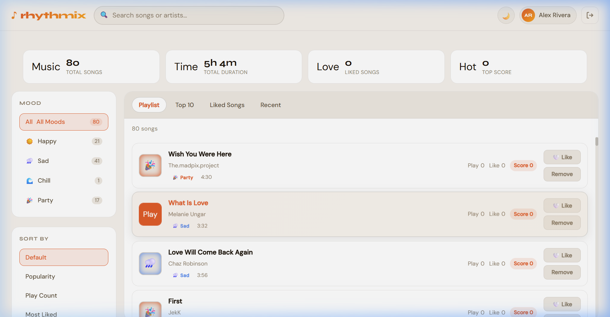

# Rhythmix - Music Playlist Organizer

Rhythmix is a React-based music playlist organizer that demonstrates practical use of Data Structures and Algorithms through an interactive music app. It supports playback, likes, search, filtering, and algorithm-driven playlist generation using Max Heap, Greedy, Dynamic Programming, Map, and Set.



---

## Features

| Feature | Description |
|---|---|
| Authentication | Session-based login with protected dashboard route |
| Music Playback | In-browser audio player with play, pause, previous, next, and progress bar |
| Mood Filtering | Browse songs by happy, sad, chill, and party moods |
| Real-time Search | Search songs by title or artist |
| Liked Songs | Save favorites with persistent storage |
| Top 10 Rankings | Ranks songs by popularity using a Max Heap |
| DP Mix Generator | Builds the optimal playlist under a chosen time budget using Dynamic Programming |
| Greedy Mix Generator | Builds a fast time-limited playlist using greedy score density |
| Recently Played | Tracks recent playback history |
| Responsive UI | Works across desktop and mobile layouts |
| Jamendo API Support | Uses Jamendo music data when configured, with sample-song fallback |

---

## Tech Stack

| Technology | Purpose |
|---|---|
| React 18 | Component-based UI |
| React Router v6 | Routing and protected pages |
| CSS Modules | Scoped styling |
| Context API | Auth and theme state |
| Jamendo API | Optional music data source |

---

## DSA Used

### 1. Max Heap Priority Queue
The Top 10 tab uses a custom Max Heap to rank songs by popularity score.

Score formula:

```text
score = (0.6 * play_count) + (0.4 * likes)
```

How it works:
1. Insert all songs into the heap with their score.
2. Repeatedly extract the maximum score.
3. Show the highest-ranked songs first.

Complexity:
- Insert: `O(log n)`
- Extract max: `O(log n)`
- Full ranking: `O(n log n)`

### 2. Dynamic Programming
The DP Mix tab solves a playlist optimization problem similar to 0/1 Knapsack.

Idea:
- Song score is the value.
- Song duration is the weight.
- Time budget is the capacity.
- The algorithm finds the highest scoring subset of songs without exceeding the selected duration.

Why this matters:
- It demonstrates optimal subset selection.
- It proves a stronger DSA concept than simple sorting.

Complexity:
- `O(n * capacity)` using normalized time slots

### 3. Greedy Algorithm
The Greedy Mix tab selects songs by highest score-per-second ratio until the time budget is filled.

Why this matters:
- It provides a fast heuristic.
- It can be compared directly with DP to show the difference between locally optimal and globally optimal strategies.

Complexity:
- Sorting: `O(n log n)`
- Selection: `O(n)`

### 4. Map
Mood-based song grouping uses a JavaScript `Map` for efficient bucket lookup.

Complexity:
- Lookup: `O(1)` average case

### 5. Set
Liked songs are stored in a JavaScript `Set`.

Complexity:
- Add: `O(1)` average case
- Delete: `O(1)` average case
- Membership check: `O(1)` average case

---

## Project Structure

```text
music-playlist-organizer/
|-- public/
|   `-- index.html
|-- src/
|   |-- components/
|   |   |-- AddSongModal.jsx
|   |   |-- Navbar.jsx
|   |   |-- Playlist.jsx
|   |   `-- SongCard.jsx
|   |-- context/
|   |   |-- AuthContext.js
|   |   `-- ThemeContext.js
|   |-- data/
|   |   `-- songs.js
|   |-- pages/
|   |   |-- Dashboard.jsx
|   |   `-- Login.jsx
|   |-- utils/
|   |   |-- helpers.js
|   |   |-- jamendo.js
|   |   `-- musicIndex.js
|   |-- App.jsx
|   |-- index.css
|   `-- index.js
|-- package.json
`-- README.md
```

---

## Getting Started

### Prerequisites

- Node.js 16+
- npm 8+

### Installation

1. Clone the repository:

```bash
git clone https://github.com/your-username/music-playlist-organizer.git
cd music-playlist-organizer
```

2. Install dependencies:

```bash
npm install
```

3. Optional: add Jamendo client ID in `.env`

```env
REACT_APP_JAMENDO_CLIENT_ID=your_jamendo_client_id
```

4. Start the app:

```bash
npm start
```

5. Open `http://localhost:3000`

---

## Demo Credentials

| Username | Password | Display Name |
|---|---|---|
| `demo` | `demo123` | Alex Rivera |
| `admin` | `admin123` | Sam Chen |
| `music` | `music123` | Jordan Park |

---

## Why This Fits a DSA Project

This project is not only a frontend UI. The main music features are backed by concrete algorithmic decisions:

- ranking with Max Heap
- playlist optimization with Dynamic Programming
- heuristic playlist generation with Greedy
- efficient grouping with Map
- efficient favorite tracking with Set

That makes it suitable for a DSA-focused submission while still being easy to demonstrate visually.

---

## License

This project is for educational use.
